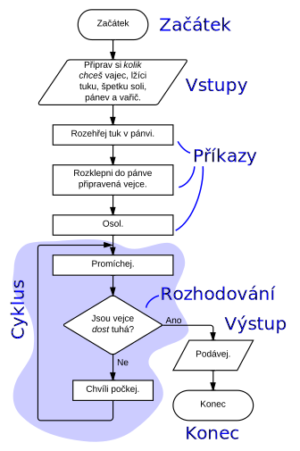
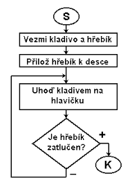
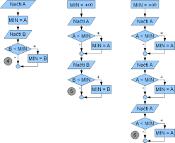

zpět na [[Programování a databázové systémy]]

_Příklad **dumb** vývojového diagramu_

_Lepší **příklad** diagramu pro pochopení_

Těmito příklady je nám jásné jak vypadá podmínka, příkazy.

*Další příklad kde používáme __vstup a výstup__*
